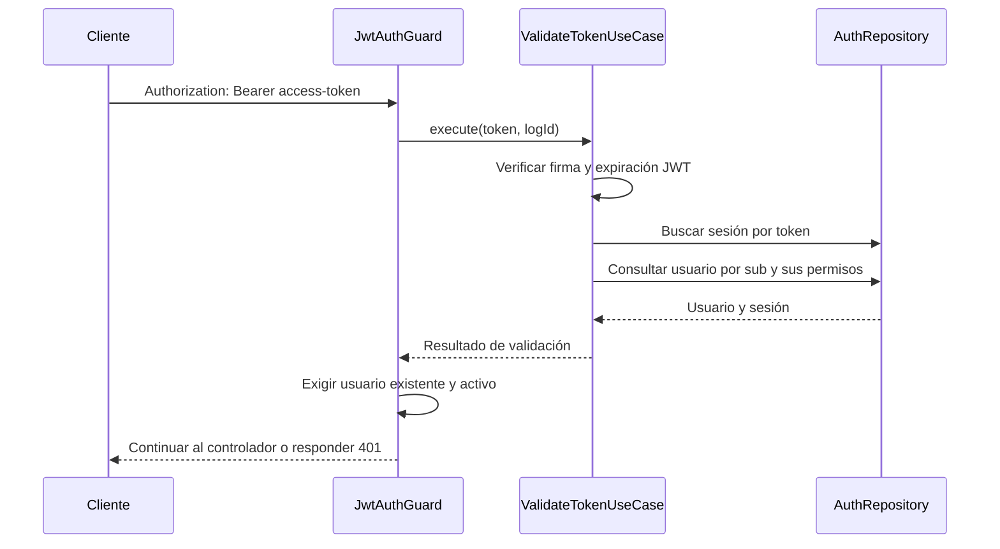

# Módulo Auth

El módulo `AuthModule` implementa el inicio de sesión, la renovación de tokens, la consulta del usuario autenticado y el cierre de sesión. Utiliza JWT y almacena sesiones y tokens de renovación en PostgreSQL mediante [DatabaseModule](database.md).

La autenticación de las rutas protegidas requiere tanto un JWT válido como una sesión persistida y un usuario activo. Los permisos se obtienen del perfil del usuario al consultar la base de datos; no se incluyen en el JWT.

## Estructura e integración

```text
src/modules/auth/
├── auth.module.ts
├── application/                 # Login, logout, renovación y validación
├── domain/
│   ├── models/                  # IUser, ISession e IRefreshToken
│   └── repositories/            # Contrato IAuthRepository
└── infrastructure/
    ├── controllers/             # AuthController
    ├── dto/                     # Entradas y par de tokens de salida
    ├── guards/                  # JwtAuthGuard y PermissionsGuard
    ├── repositories/            # Adaptador AuthRepository
    └── strategies/              # Estrategia Passport JWT
```

[AuthModule](../src/modules/auth/auth.module.ts) importa `DatabaseModule`, `PassportModule` y `JwtModule`. Registra `AuthRepository` bajo el símbolo `AUTH_REPOSITORY`, los cuatro casos de uso, `JwtStrategy` y `JwtAuthGuard`. Exporta `JwtAuthGuard` y `ValidateTokenUseCase`. Al inicializarse registra `AuthModule initialized`.

`PermissionsGuard` se utiliza mediante `@UseGuards`, pero no figura entre los proveedores ni las exportaciones de `AuthModule`. El decorador `Permissions` está en [src/common/decorators/permissions.decorator.ts](../src/common/decorators/permissions.decorator.ts).

## Configuración

[AppConfig](../src/app.config.ts) carga las variables de entorno con `dotenv` y convierte las duraciones con `Number`.

| Variable | Valor predeterminado | Uso |
| --- | --- | --- |
| `JWT_SECRET` | `mi_secret_key` | Firma y verificación del access token. |
| `JWT_EXPIRESIN` | `900000` | Duración del access token, en segundos. |
| `JWT_REFRESH_SECRET` | `mi_refresh_secret_key` | Firma y verificación del refresh token. |
| `JWT_REFRESH_EXPIRESIN` | `3600000` | Duración del refresh token, en segundos. |

Los valores numéricos enviados a `expiresIn` se interpretan en segundos. Aunque los comentarios de `AppConfig` indican 15 minutos y 1 hora, los valores actuales equivalen a 10 días y 10 horas, y a 41 días y 16 horas, respectivamente. `example.env` contiene esos mismos valores.

Para configurar 15 minutos de acceso y 1 hora de renovación:

```dotenv
JWT_SECRET=reemplazar_por_un_secreto_de_acceso
JWT_EXPIRESIN=900
JWT_REFRESH_SECRET=reemplazar_por_otro_secreto_de_renovacion
JWT_REFRESH_EXPIRESIN=3600
```

Los secretos del ejemplo son marcadores para sustituir. Las duraciones deben ser números; cadenas como `15m` no son compatibles con la conversión actual de `AppConfig`.

La base de datos debe estar configurada y disponer del esquema de autenticación. La preparación y los datos iniciales se describen en [database.md](database.md).

## API HTTP

El [controlador](../src/modules/auth/infrastructure/controllers/auth.controller.ts) utiliza el prefijo `/api/auth`. Aplica `ValidationPipe({ whitelist: true, forbidNonWhitelisted: true })`: las entradas que no cumplen el DTO y las propiedades adicionales en los cuerpos validados producen HTTP 400.

| Método y ruta | Autenticación | Entrada | Respuesta exitosa |
| --- | --- | --- | --- |
| `POST /api/auth/login` | Pública | `userName` y `password` en JSON | HTTP 201; par de tokens en `data`. |
| `GET /api/auth/info` | Access token Bearer | Sin cuerpo | HTTP 200; usuario y permisos en `data`. |
| `POST /api/auth/refresh` | Refresh token en el cuerpo | `token` en JSON | HTTP 200; par de tokens en `data`. |
| `DELETE /api/auth/logout` | Access token Bearer | Sin cuerpo | HTTP 200; mensaje de cierre de sesión. |

Las respuestas del controlador usan [ResponseDto](../src/modules/shared/utils/infrastructure/response.dto.ts), con `statusCode`, `logId`, `message` y, según corresponda, `data` o `error`. Los campos con valor `undefined` se omiten al serializar JSON.

### Iniciar sesión

`LoginDto` exige `userName` y `password` definidos, de tipo string, no vacíos y con un máximo de 64 caracteres cada uno.

```http
POST /api/auth/login
Content-Type: application/json

{
  "userName": "mi_usuario",
  "password": "mi_clave"
}
```

Respuesta de ejemplo:

```json
{
  "statusCode": 200,
  "logId": "12345678",
  "message": "login successful",
  "data": {
    "accessToken": "<access-token>",
    "refreshToken": "<refresh-token>"
  }
}
```

El estado HTTP efectivo es **201**, porque el método POST no declara `@HttpCode(200)`. El `statusCode` del cuerpo es **200**.

`LoginUseCase` busca al usuario mediante el repositorio, que compara la contraseña calculando su hash SHA-256. Si lo encuentra, firma ambos tokens con el payload `{ username: user.userName, sub: user.userId }`, guarda la sesión y después el refresh token, y devuelve `AccessDto`. Las fechas persistidas se calculan a partir de `exp * 1000`.

### Consultar el usuario autenticado

```http
GET /api/auth/info
Authorization: Bearer <access-token>
```

Devuelve `req.user` en `data`, con `message: ""`. Incluye `userId`, `userName`, nombres, correo, teléfono, `isActive`, fechas disponibles, `profileId` y `permissions`.

Aunque la firma del controlador declara `ResponseDto<AccessDto>`, el contenido real es el usuario. La interfaz `IUser` declara `password`, pero las lecturas actuales de `UserEntity` excluyen esa columna mediante `select: false`; normalmente queda `undefined` y no aparece en el JSON.

### Renovar tokens

```http
POST /api/auth/refresh
Content-Type: application/json

{
  "token": "<refresh-token>"
}
```

`RefreshDto` exige un `token` de tipo string y no vacío. La respuesta tiene la misma estructura de tokens que login, con `message: "refresh token successful"` y HTTP 200.

`RefreshTokenUseCase` verifica el JWT con `JWT_REFRESH_SECRET`, busca el token exacto en la base de datos y obtiene al usuario asociado al registro. Luego firma y persiste otro access token y otro refresh token. El registro de renovación anterior y las sesiones anteriores permanecen almacenados; no hay invalidación del token utilizado.

### Cerrar sesión

```http
DELETE /api/auth/logout
Authorization: Bearer <access-token>
```

`JwtAuthGuard` obtiene `req.sessionId` y `LogoutUseCase` solicita su eliminación. La respuesta contiene `statusCode: 200`, `logId` y `message: "logout successful"`, sin `data`.

La operación no recibe un token en el cuerpo. Existe `LogoutDto`, pero el controlador no lo utiliza. El cierre elimina únicamente la sesión identificada; no revoca los refresh tokens ni otras sesiones del usuario.

## Validación de acceso



[JwtAuthGuard](../src/modules/auth/infrastructure/guards/jwt.authguard.ts) implementa `CanActivate` directamente. Exige el prefijo exacto `Bearer ` y delega en `ValidateTokenUseCase`. Si la validación tiene éxito, asigna `request.user`, `request.sessionId` y `request.logId`.

`ValidateTokenUseCase.execute(token, logId)` devuelve `{ user, session }` si encuentra una sesión, y `undefined` si no la encuentra. La propiedad `user` también puede ser `undefined`; corresponde al guard rechazar ese resultado y comprobar `isActive`. El caso de uso no compara explícitamente `session.userId` con `sub` ni comprueba `session.expiresAt`: verifica la expiración del JWT.

La [estrategia Passport](../src/modules/auth/infrastructure/strategies/jwt.strategy.ts) está registrada y devuelve `{ userId: payload.sub, username: payload.username }`. El guard utilizado por estos endpoints no extiende `AuthGuard('jwt')` y no usa esa estrategia; su flujo incluye la consulta de sesión en la base de datos.

## Autorización por permisos

`AuthRepository` transforma las asociaciones `profile.profileOptions` en códigos de permisos, consultando `OptionTypeOrmRepository`. Solo incorpora opciones con `isActive=true`. El estado activo del perfil no se comprueba durante ese mapeo.

`PermissionsGuard` lee la metadata del método y, en su ausencia, la del controlador. La metadata del método reemplaza la del controlador. Si no hay permisos requeridos, permite continuar. Si los hay, exige que `request.user.permissions` contenga **todos** los códigos indicados; de lo contrario, devuelve `false`, produciendo HTTP 403.

Ejemplo de protección de una ruta, siguiendo el patrón de `UsersController`:

```typescript
import { Controller, Get, Module, Req, UseGuards } from '@nestjs/common';
import type { Request } from 'express';
import { AuthModule } from 'src/modules/auth/auth.module';
import { JwtAuthGuard } from 'src/modules/auth/infrastructure/guards/jwt.authguard';
import { PermissionsGuard } from 'src/modules/auth/infrastructure/guards/permissions.guard';
import { Permissions } from 'src/common/decorators/permissions.decorator';

@Controller('api/example')
@UseGuards(JwtAuthGuard, PermissionsGuard)
export class ExampleController {
  @Get()
  @Permissions('USER_READ')
  read(@Req() req: Request) {
    return req.user;
  }
}

@Module({
  imports: [AuthModule],
  controllers: [ExampleController],
})
export class ExampleModule {}
```

El orden permite que `JwtAuthGuard` establezca el usuario antes de evaluar permisos. `@Permissions` por sí solo no ejecuta la validación. Los endpoints propios de autenticación no utilizan `PermissionsGuard`.

## Contratos y persistencia

[IAuthRepository](../src/modules/auth/domain/repositories/auth.repository.interface.ts) define el contrato inyectado en los casos de uso:

| Método | Retorno | Propósito |
| --- | --- | --- |
| `getUserByUsernameAndPassword(userName, password, logId)` | `Promise<IUser \| undefined>` | Buscar credenciales y mapear permisos. |
| `getUserByUserId(userId, logId)` | `Promise<IUser \| undefined>` | Obtener usuario y permisos actuales. |
| `getSessionByToken(token, logId)` | `Promise<ISession \| undefined>` | Buscar una sesión por el access token exacto. |
| `getRefreshTokenByToken(token, logId)` | `Promise<IRefreshToken \| undefined>` | Buscar un refresh token persistido. |
| `saveSession(session, logId)` | `Promise<string>` | Insertar una sesión y devolver su ID. |
| `saveRefreshToken(refreshToken, logId)` | `Promise<string>` | Insertar un refresh token y devolver su ID. |
| `deleteSessionBySessionId(sessionId, logId)` | `Promise<void>` | Comprobar la sesión y eliminarla. |

`ISession` contiene `sessionId?`, `userId`, `token` y `expiresAt`. `IRefreshToken` contiene `userId`, `token` y `expiresAt`. Los tokens se guardan completos en `auth_session` y `auth_user_refresh_token`. El adaptador utiliza los repositorios de usuarios, opciones, sesiones y tokens del módulo database.

## Errores y registros

| Situación | Comportamiento actual |
| --- | --- |
| DTO inválido o propiedades adicionales | HTTP 400, respuesta estándar de validación de Nest. |
| Credenciales incorrectas o error en login | HTTP 500, `message: "login failed"`, `error: ""`. |
| Cabecera ausente, formato incorrecto o token ausente | HTTP 401 con el mensaje correspondiente del guard. |
| Token inválido, vencido, sesión ausente, usuario inexistente/inactivo o error de persistencia durante la validación | HTTP 401; normalmente `Unauthorized.`. |
| Refresh token inválido, vencido, inexistente o usuario no encontrado | Normalmente HTTP 500, `message: "refresh token failed"`. |
| Permisos insuficientes en una ruta que aplica `PermissionsGuard` | HTTP 403. |

`UseCaseError` no define un estado HTTP. En refresh, el controlador utiliza `error.status || 500`. Durante la validación del access token, los errores JWT quedan envueltos en `UseCaseError`, por lo que las ramas del guard que distinguen `TokenExpiredError` y `JsonWebTokenError` normalmente no reciben esos errores directamente.

Las respuestas de guards y del pipe no usan necesariamente `ResponseDto`. El `logId` lo genera el guard para rutas protegidas y el interceptor global para las públicas. En las respuestas exitosas, el controlador establece `req.logData=false` para omitir el cuerpo de respuesta en el registro del interceptor.

## Particularidades de la implementación actual

- Login y refresh no rechazan explícitamente usuarios inactivos antes de emitir tokens. El bloqueo por `isActive=false` ocurre al usar una ruta protegida por `JwtAuthGuard`.
- Renovar tokens no revoca los anteriores. Un refresh token persistido puede reutilizarse mientras supere la verificación JWT, incluso después del logout de una sesión.
- `LogoutUseCase` captura y descarta las excepciones. El endpoint puede informar éxito aunque la eliminación haya fallado.
- El guard consulta permisos en cada validación; los cambios en las opciones y asociaciones se obtienen de la base de datos, sin depender de permisos incluidos en un JWT.
- Guardar la sesión y guardar el refresh token son operaciones separadas, sin una transacción conjunta en los casos de uso. Un fallo en la segunda puede dejar la primera persistida.
- No se comparan las fechas `expiresAt` persistidas al validar acceso o renovar; la expiración efectiva se verifica con el JWT. El módulo no implementa limpieza automática de registros vencidos.
- Los payloads no incluyen un identificador único de token (`jti`). Emisiones para el mismo usuario dentro del mismo segundo pueden producir tokens iguales si coinciden payload, secreto y duración.

Esta documentación describe el código actual; no implica una comprobación de los flujos contra una base de datos en ejecución.
