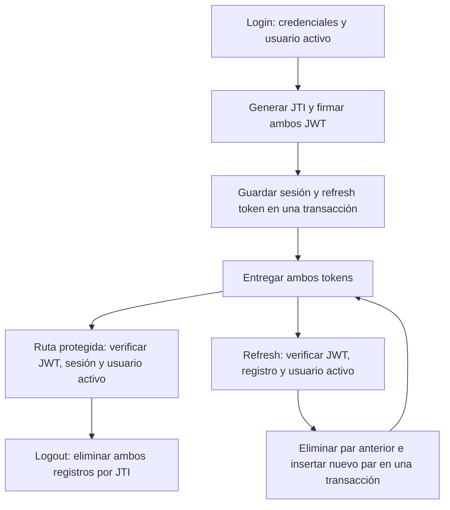

# Módulo de autenticación

El módulo [`src/modules/auth`](../src/modules/auth) implementa inicio de sesión, renovación de tokens, consulta del usuario autenticado y cierre de sesión. Combina JWT con sesiones persistidas: las rutas protegidas requieren un token válido, una sesión existente y un usuario activo.

## Arquitectura

| Componente | Responsabilidad |
| --- | --- |
| [`AuthModule`](../src/modules/auth/auth.module.ts) | Registra controladores, casos de uso, repositorio, Passport y JWT. |
| [`LoginController`](../src/modules/auth/infrastructure/controllers/login.controller.ts) | Expone el inicio de sesión. |
| [`RefreshController`](../src/modules/auth/infrastructure/controllers/refresh.controller.ts) | Expone la renovación del par de tokens. |
| [`InfoController`](../src/modules/auth/infrastructure/controllers/info.controller.ts) | Devuelve el usuario autenticado. |
| [`LogoutController`](../src/modules/auth/infrastructure/controllers/logout.controller.ts) | Expone el cierre de la sesión actual. |
| `application` | Contiene `LoginUseCase`, `RefreshTokenUseCase`, `ValidateTokenUseCase` y `LogoutUseCase`. |
| `domain/models` | Define `IUser`, `ISession` e `IRefreshToken`. |
| `domain/repositories` | Define el contrato `IAuthRepository`. |
| `infrastructure/dto` | Define las entradas de login y renovación, y la salida con ambos tokens. |
| `infrastructure/guards` | Implementa autenticación y comprobación de permisos. |
| `infrastructure/strategies` | Registra la estrategia JWT de Passport. |
| [`AuthRepository`](../src/modules/auth/infrastructure/repositories/auth.repository.ts) | Adapta los repositorios TypeORM al dominio y coordina las transacciones. |

`AuthModule` importa `PassportModule` y `JwtModule`, y registra `AUTH_REPOSITORY`, un `Symbol`, con la implementación `AuthRepository`. Exporta `JwtAuthGuard` y `ValidateTokenUseCase` para otros módulos.

`AuthRepository` consume `UserTypeOrmRepository`, `SessionTypeOrmRepository`, `RefreshTokenTypeOrmRepository` y `OptionTypeOrmRepository`. Estos proveedores se exportan desde `DatabaseModule`, que es global y se importa en `AppModule`. La conexión, las entidades y las migraciones se describen en [Base de datos](database.md).

Los cuatro controladores heredan de [`CommonController`](../src/modules/shared/controllers/common.controller.ts). Login, refresh y logout utilizan su método `getHttpException`; info construye directamente su respuesta de error.

## Configuración

[`app.config.ts`](../src/app.config.ts) carga el entorno mediante `dotenv`:

| Variable | Propiedad | Valor predeterminado |
| --- | --- | --- |
| `JWT_SECRET` | `jwtSecret` | `mi_secret_key` |
| `JWT_EXPIRESIN` | `jwtExpiresIn` | `900000` |
| `JWT_REFRESH_SECRET` | `jwtRefreshSecret` | `mi_refresh_secret_key` |
| `JWT_REFRESH_EXPIRESIN` | `jwtRefreshExpiresIn` | `3600000` |

Las duraciones se convierten con `Number` y se pasan a `JwtService.sign` como `expiresIn`. Los valores numéricos representan **segundos**. Los valores predeterminados equivalen a 10 días y 10 horas para acceso, y 41 días y 16 horas para renovación; no coinciden con los comentarios `15m` y `1h` del código.

Ejemplo para configurar 15 minutos y una hora:

```dotenv
JWT_SECRET=reemplazar_por_un_secreto_de_acceso
JWT_EXPIRESIN=900
JWT_REFRESH_SECRET=reemplazar_por_un_secreto_de_renovacion
JWT_REFRESH_EXPIRESIN=3600
```

Estas variables de duración no admiten expresiones como `15m`, porque se convierten a número. No existe validación explícita de configuración en `AppConfig`.

## API HTTP

Los controladores comparten la ruta base `/api/auth`. El arranque no agrega un prefijo global. El puerto predeterminado es `4321`, configurable con `PORT`.

| Método | Ruta | Autenticación | Éxito | Datos de respuesta |
| --- | --- | --- | --- | --- |
| `POST` | `/api/auth/login` | Pública | `201` | `accessToken` y `refreshToken`. |
| `POST` | `/api/auth/refresh` | Refresh token en el cuerpo | `200` | Nuevo `accessToken` y nuevo `refreshToken`. |
| `GET` | `/api/auth/info` | Bearer access token | `200` | Usuario con permisos. |
| `DELETE` | `/api/auth/logout` | Bearer access token | `200` | Sin `data`. |

Las respuestas de los controladores usan [`ResponseDto`](../src/modules/shared/utils/infrastructure/response.dto.ts): `statusCode`, `logId`, `message` y, según el resultado, `data` o `error`. Sus propiedades opcionales sin valor se omiten al serializar a JSON.

### Inicio de sesión

```http
POST /api/auth/login
Content-Type: application/json

{
  "userName": "usuario",
  "password": "contraseña"
}
```

`LoginDto` exige ambos campos definidos, de tipo cadena, no vacíos y de hasta 64 caracteres. No recorta espacios ni normaliza los valores. `LoginController` aplica `ValidationPipe({ whitelist: true, forbidNonWhitelisted: true })`, por lo que también rechaza propiedades adicionales.

Respuesta de éxito:

```json
{
  "statusCode": 201,
  "logId": "12345678",
  "message": "login successful",
  "data": {
    "accessToken": "<JWT de acceso>",
    "refreshToken": "<JWT de renovación>"
  }
}
```

### Renovación

```http
POST /api/auth/refresh
Content-Type: application/json

{
  "token": "<JWT de renovación>"
}
```

La entrada se llama `token`, aunque el campo de salida se llama `refreshToken`. La respuesta tiene `statusCode: 200`, `message: "refresh token successful"` y el mismo formato de `data` del login.

`RefreshDto` declara `@IsString()` y `@IsNotEmpty()`, pero `RefreshController` no aplica `ValidationPipe` y `main.ts` tampoco registra uno global. Por tanto, esos decoradores no validan la solicitud en la configuración actual. Los errores de verificación del token se procesan en el caso de uso.

El cliente debe reemplazar **ambos tokens** por los recibidos. La renovación elimina los registros del JTI anterior e inserta un nuevo par.

### Información del usuario

```http
GET /api/auth/info
Authorization: Bearer <JWT de acceso>
```

Devuelve `statusCode: 200`, `message: "User found"` y `data: req.user`. Incluye `userId`, `userName`, nombres, contacto, estado, fechas, `profileId` y `permissions`. No devuelve los tokens ni la sesión.

Aunque `IUser` y su mapeo contienen `password`, la entidad declara la columna con `select: false`. Las lecturas actuales no recuperan ese valor y queda omitido en JSON. La firma de `info` declara `ResponseDto<AccessDto>`, pero su contenido real es el usuario.

`InfoController` aplica `ValidationPipe`, aunque esta ruta no recibe un DTO de entrada. Inyecta `LogoutUseCase`, pero no lo utiliza.

### Cierre de sesión

```http
DELETE /api/auth/logout
Authorization: Bearer <JWT de acceso>
```

Respuesta:

```json
{
  "statusCode": 200,
  "logId": "12345678",
  "message": "logout successful"
}
```

El ID de sesión procede del guard y no se envía en el cuerpo. El cierre elimina la sesión y el registro de renovación asociados al mismo JTI. No elimina las demás sesiones del usuario. La ruta necesita un access token vigente.

## Casos de uso y ciclo de vida

Ambos JWT contienen `username`, `sub` (ID del usuario) y `jti`, además de las marcas temporales generadas al firmar. Cada par comparte un JTI creado con `Utils.generateJti()`, que usa `randomUUID()`. Los tokens tienen secretos y duraciones independientes. Los permisos se consultan en la base de datos y no se incluyen en los JWT.


```mermaid
flowchart TD
    A[Login: credenciales y usuario activo] --> B[Generar JTI y firmar ambos JWT]
    B --> C[Guardar sesión y refresh token en una transacción]
    C --> D[Entregar ambos tokens]
    D --> E[Ruta protegida: verificar JWT, sesión y usuario activo]
    D --> F[Refresh: verificar JWT, registro y usuario activo]
    F --> G[Eliminar par anterior e insertar nuevo par en una transacción]
    G --> D
    E --> H[Logout: eliminar ambos registros por JTI]
```

### `LoginUseCase`

[`execute(loginDto, logId)`](../src/modules/auth/application/login.usecase.ts) devuelve `Promise<AccessDto>`:

1. Busca al usuario por nombre y contraseña mediante el repositorio. La implementación de base de datos calcula SHA-256 sin sal mediante `Utils.createHash` y compara el hash.
2. Rechaza un usuario inexistente o inactivo.
3. Genera el JTI y firma ambos tokens.
4. Calcula cada `expiresAt` a partir de `new Date(decoded.exp * 1000)`.
5. Guarda sesión y refresh token con `saveSessionAndRefreshToken(undefined, ...)` y devuelve los JWT.

Cada login crea una sesión independiente sin eliminar las anteriores.

### `RefreshTokenUseCase`

[`execute(refresh_token, logId)`](../src/modules/auth/application/refreshToken.usecase.ts) devuelve `Promise<AccessDto>`:

1. Verifica el JWT con `jwtRefreshSecret`.
2. Busca el registro persistido por JTI.
3. Obtiene al usuario desde `refreshToken.userId` y exige que exista y esté activo.
4. Genera un nuevo JTI y firma un nuevo par.
5. Elimina los registros del JTI anterior y guarda los nuevos mediante `saveSessionAndRefreshToken(previousJti, ...)`.

No necesita un access token vigente ni consulta la sesión anterior. Tras completar la renovación, el access token anterior deja de autorizar solicitudes porque su sesión fue eliminada, aunque el JWT aún no haya vencido.

### `ValidateTokenUseCase`

[`execute(token, logId)`](../src/modules/auth/application/validateToken.usecase.ts) verifica el JWT con `jwtSecret`, busca una sesión por JTI y consulta al usuario activo por `sub`.

Devuelve `Promise<{ user: IUser | undefined; session: ISession } | undefined>`. Sin sesión devuelve `undefined`; si encuentra sesión pero no usuario activo, devuelve el objeto con `user: undefined`. El guard rechaza ambos casos.

### `LogoutUseCase`

[`execute(sessionId, logId)`](../src/modules/auth/application/logout.usecase.ts) devuelve `Promise<void>`. Consulta la sesión por ID, lanza un error de validación si no existe y elimina sesión y refresh token por su JTI.

## Autenticación y permisos

### `JwtAuthGuard`

[`JwtAuthGuard`](../src/modules/auth/infrastructure/guards/jwt.authguard.ts) implementa `CanActivate` y llama directamente a `ValidateTokenUseCase`. Exige el prefijo exacto `Bearer ` en `Authorization`.

Al autorizar asigna `request.logId`, `request.user` y `request.sessionId`. La identidad y los permisos proceden de la base de datos, no solo del contenido del token.

El guard distingue encabezado ausente (`Authorization header is missing.`), prefijo incorrecto (`Invalid authorization header format.`) y token ausente (`Token is missing.`). Los fallos dentro de la validación terminan normalmente en `Unauthorized.`: el caso de uso envuelve los errores JWT en `UseCaseError`, por lo que no llegan directamente a las ramas `TokenExpiredError` y `JsonWebTokenError` del guard. La ausencia de sesión o usuario activo y los errores de persistencia también se convierten en `401`.

### `PermissionsGuard`

[`PermissionsGuard`](../src/modules/auth/infrastructure/guards/permissions.guard.ts) lee la metadata de [`@Permissions`](../src/common/decorators/permissions.decorator.ts), primero en el método y luego en la clase. La metadata del método reemplaza a la de la clase.

Si no hay permisos requeridos, permite la solicitud. Si los hay, necesita `request.user` y comprueba que estén **todos** presentes en `user.permissions`. Cuando devuelve `false`, Nest rechaza con `403`.

Ejemplo de aplicación a un método de controlador:

```typescript
@UseGuards(JwtAuthGuard, PermissionsGuard)
@Permissions('USER_READ')
@Get(':userId')
```

El orden permite completar `request.user` antes de comprobar permisos. El módulo consumidor importa `AuthModule` para utilizar el guard exportado. `PermissionsGuard` se referencia directamente desde los controladores; no está incluido en los proveedores ni exportaciones de `AuthModule`.

`AuthRepository.mapToIUser` cruza `profile.profileOptions` con las opciones disponibles y agrega sus códigos solo si la opción está activa. Sin perfil o asignaciones devuelve un arreglo vacío. No verifica `profile.isActive`. Los cambios de permisos se reflejan en la siguiente validación porque el usuario se consulta nuevamente.

### `JwtStrategy`

[`JwtStrategy`](../src/modules/auth/infrastructure/strategies/jwt.strategy.ts) registra la estrategia Passport, extrae el Bearer token, verifica su expiración y utiliza `jwtSecret`. Su método `validate` devuelve `{ userId: payload.sub, username: payload.username }`.

El guard propio no hereda de `AuthGuard('jwt')` ni utiliza esta estrategia. La estrategia por sí sola no consulta sesiones, estado del usuario ni permisos.

## Dominio y persistencia

| Modelo | Campos |
| --- | --- |
| `IUser` | `userId`, `userName`, `password`, `firstName`, `middleName?`, `lastName`, `email`, `phone`, `isActive`, `createdAt`, `updatedAt`, `profileId`, `permissions?`. |
| `ISession` | `sessionId?`, `userId`, `jti`, `expiresAt`. |
| `IRefreshToken` | `userId`, `jti`, `expiresAt`. |

Se persiste el JTI, no el JWT completo, en `auth_user_session` y `auth_user_refresh_token`. Ambos registros conservan `userId` y `expiresAt`.

El contrato [`IAuthRepository`](../src/modules/auth/domain/repositories/auth.repository.interface.ts) incluye los siguientes métodos. Todos reciben `logId` como último argumento y devuelven promesas:

| Método | Resultado | Responsabilidad |
| --- | --- | --- |
| `getUserByUsernameAndPassword(userName, password, logId)` | `IUser \| undefined` | Buscar credenciales y mapear permisos. |
| `getUserByUserId(userId, logId)` | `IUser \| undefined` | Consultar usuario sin filtrar estado. |
| `getActiveUserByUserId(userId, logId)` | `IUser \| undefined` | Consultar usuario activo. |
| `getSessionByJTI(jti, logId)` | `ISession \| undefined` | Consultar sesión del token. |
| `getSessionById(sessionId, logId)` | `ISession \| undefined` | Consultar sesión para logout. |
| `getRefreshTokenByJTI(jti, logId)` | `IRefreshToken \| undefined` | Consultar registro de renovación. |
| `saveSession(session, logId)` | `string` | Guardar sesión y devolver su ID. |
| `saveRefreshToken(refreshToken, logId)` | `string` | Guardar registro de renovación y devolver su ID. |
| `saveSessionAndRefreshToken(previousJti, session, refreshToken, logId)` | `void` | Guardar el par; si recibe JTI previo, eliminar el anterior. |
| `deleteSessionAndRefreshToken(jti, logId)` | `void` | Eliminar ambos registros por JTI. |

Los métodos que operan sobre el par usan y esperan `DataSource.transaction`, pasando el mismo `EntityManager` a ambas operaciones. En la renovación, borrados e inserciones pertenecen a una sola transacción. Los métodos de guardado individual no coordinan una transacción compartida y no se usan para emitir los pares en los casos de uso actuales.

## Errores y trazabilidad

`CommonController.getHttpException` convierte `UseCaseError` de nivel `Validation` a `400` y de nivel `Unknown` a `500`, conservando `error.message` en el campo `error` de la respuesta.

| Situación | HTTP | Respuesta actual |
| --- | --- | --- |
| Login con DTO inválido o campos adicionales | `400` | Error estándar de `ValidationPipe`, fuera del envoltorio del controlador. |
| Credenciales incorrectas | `400` | `message: "login failed"`, `error: "User not found"`. |
| Usuario inactivo en login o refresh | `400` | `error: "User is not active"`. |
| Refresh token válido sin registro persistido | `400` | `message: "refresh token failed"`, `error: "Refresh token not found"`. |
| Usuario inexistente durante refresh | `400` | `error: "User not found"`. |
| Refresh token inválido o vencido | `500` | Se envuelve como error `Unknown`, con `error: "Internal server error"`. |
| Sesión ausente dentro de `LogoutUseCase` | `400` | `message: "logout failed"`, `error: "Session not found"`. Normalmente el guard detecta antes la ausencia de sesión. |
| Fallo de persistencia en login, refresh o logout | `500` | `error: "Internal server error"`. |
| Fallo del guard de autenticación | `401` | `UnauthorizedException`. |
| Permisos insuficientes | `403` | Rechazo de `PermissionsGuard`. |

Si `CommonController` recibe una excepción que no es `UseCaseError`, devuelve `500` con `message: "login failed"` y `error: "internal server error"`, incluso desde refresh o logout. El bloque `catch` de info devuelve `500` con `message` y `error` vacíos; los errores de su guard ocurren antes de ejecutar ese método.

[`LogInterceptor`](../src/modules/shared/interceptors/log.interceptor.ts) genera un `logId` si aún no existe. El guard genera uno para las solicitudes protegidas y lo asigna al autorizar. Los casos de uso y repositorios reciben ese identificador para correlacionar registros.

En respuestas exitosas, los cuatro controladores establecen `req.logData = false`, evitando que el interceptor registre el cuerpo con tokens o datos del usuario. Algunos mensajes internos todavía usan el nombre `AuthController`; info registra `AuthController.login`.

## Límites de la implementación actual

- La expiración se verifica en el JWT. Las consultas de sesiones y refresh tokens no filtran por `expiresAt`, y el módulo no incluye limpieza automática de registros vencidos.
- La validación de acceso busca la sesión por JTI y al usuario por `sub`, sin comparar explícitamente `session.userId` con ese `sub`.
- La lectura del refresh token ocurre antes de la transacción de reemplazo. No existe bloqueo ni comprobación de filas eliminadas que garantice una sola renovación ante solicitudes concurrentes con el mismo token.
- El logout requiere un access token válido. No hay un endpoint para revocar mediante refresh token ni para cerrar todas las sesiones.
- El módulo no implementa registro de usuarios, recuperación de contraseña ni revocación automática por cambio de contraseña.

Estas observaciones describen el código existente y no implican cambios en su comportamiento.
