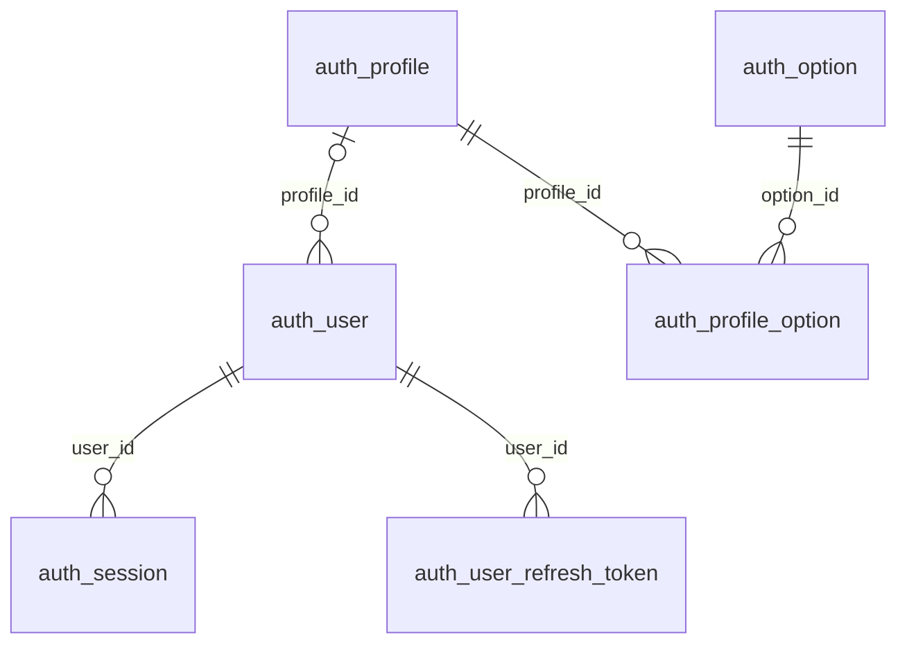

# Módulo Database

El módulo `DatabaseModule` implementa la persistencia en PostgreSQL mediante TypeORM. Configura la conexión, registra las entidades, carga las migraciones y exporta repositorios para usuarios, perfiles, opciones, sesiones y tokens de renovación.

Su implementación está en [src/modules/database](../src/modules/database/database.module.ts). No expone controladores HTTP ni está declarado como módulo global. Los módulos que necesitan sus repositorios deben importar `DatabaseModule`, como hace [UsersModule](../src/modules/users/users.module.ts).

## Estructura

```text
src/modules/database/
├── database.module.ts
├── entities/       # Mapeo entre objetos y tablas
├── migrations/     # Creación del esquema y datos iniciales
└── repositories/   # Operaciones de persistencia
```

El módulo utiliza `TypeOrmModule.forRoot` para configurar la conexión y `TypeOrmModule.forFeature` para registrar las seis entidades con el mismo nombre de conexión. Activa `autoLoadEntities` y busca archivos mediante estos patrones relativos al directorio del módulo:

```text
entities/*.entity{.ts,.js}
migrations/*.migration{.ts,.js}
```

Al inicializarse, registra el mensaje `DatabaseModule initialized`.

## Configuración

[AppConfig](../src/app.config.ts) carga las variables de entorno mediante `dotenv`. [example.env](../example.env) contiene una configuración de referencia.

| Variable | Valor predeterminado en código | Uso |
| --- | --- | --- |
| `POSTGRES_HOST` | Cadena vacía | Servidor PostgreSQL. |
| `POSTGRES_PORT` | `0` | Puerto de conexión, convertido con `Number`. |
| `POSTGRES_USERNAME` | Cadena vacía | Usuario de la base de datos. |
| `POSTGRES_PASSWORD` | Cadena vacía | Contraseña del usuario. |
| `POSTGRES_DATABASE` | Cadena vacía | Nombre de la base de datos. |
| `POSTGRES_CONNECTIONNAME` | `default` | Nombre utilizado para registrar e inyectar la conexión. |
| `POSTGRES_SYNCRONIZE` | `false` | Opción `synchronize` de TypeORM. El nombre de la variable se escribe así en el código. |
| `POSTGRES_LOGGING` | `false` | Opción `logging` de TypeORM. |
| `POSTGRES_MIGRATIONSRUN` | `false` | Ejecución de migraciones pendientes al inicializar la conexión. |
| `POSTGRES_MAXEXECUTIONTIME` | `30000` | Umbral en milisegundos para registrar consultas lentas; no es un tiempo límite de cancelación. |

Los booleanos solo se activan con los valores exactos `true` o `1`. La configuración no valida campos obligatorios ni comprueba que los valores numéricos sean válidos.

Ejemplo para una base de datos local:

```dotenv
POSTGRES_HOST=localhost
POSTGRES_PORT=5432
POSTGRES_USERNAME=postgresusr
POSTGRES_PASSWORD=postgrespwd
POSTGRES_DATABASE=postgresdb
POSTGRES_CONNECTIONNAME=postgres
POSTGRES_SYNCRONIZE=false
POSTGRES_LOGGING=false
POSTGRES_MIGRATIONSRUN=true
POSTGRES_MAXEXECUTIONTIME=30000
```

Estos valores son ilustrativos. El archivo `example.env` mantiene `POSTGRES_MIGRATIONSRUN=false`, por lo que copiarlo sin modificar esa variable no ejecuta las migraciones.

## Inicialización local

1. Disponer de PostgreSQL con la base de datos y el usuario configurados. Las migraciones crean tablas y datos, no la base de datos ni el usuario de conexión.
2. Crear `.env` a partir de `example.env` si todavía no existe y ajustar los parámetros de conexión.
3. Para crear el esquema mediante las migraciones, establecer `POSTGRES_MIGRATIONSRUN=true` y mantener `POSTGRES_SYNCRONIZE=false`.
4. Instalar las dependencias con `yarn install` e iniciar la aplicación con `yarn start:dev`.

La conexión debe permitir las operaciones de creación de tablas, claves y datos que ejecutan las migraciones. Revisar los datos iniciales descritos más abajo antes de habilitarlas en un entorno compartido.

## Entidades y relaciones

| Entidad | Tabla | Clave primaria | Contenido |
| --- | --- | --- | --- |
| `OptionEntity` | `auth_option` | `option_id` | Código, nombre, descripción y estado de una opción o permiso. |
| `ProfileEntity` | `auth_profile` | `profile_id` (UUID) | Nombre, descripción, indicadores `isInternal` e `isActive`, fechas y opciones asociadas. |
| `ProfileOptionEntity` | `auth_profile_option` | `profile_id` + `option_id` | Asociación entre perfiles y opciones. |
| `UserEntity` | `auth_user` | `user_id` (UUID) | Credenciales, datos personales, estado, fechas y perfil. |
| `RefreshTokenEntity` | `auth_user_refresh_token` | `refresh_token_id` (UUID) | Usuario, token de renovación y vencimiento. |
| `SessionEntity` | `auth_session` | `session_id` (UUID) | Usuario, token de sesión y vencimiento. |

El siguiente diagrama representa las claves foráneas creadas por las migraciones:



En las entidades, las relaciones navegables son `UserEntity.profile`, `ProfileEntity.profileOptions` y `ProfileOptionEntity.profile`. Las referencias de sesiones y tokens a usuarios, y de la tabla intermedia a opciones, están definidas como claves foráneas en migraciones, pero no como relaciones navegables en esas entidades.

`UserEntity.password` tiene `select: false`, por lo que las consultas normales no devuelven ese campo. Los repositorios de usuarios calculan su hash mediante `Utils.createHash`, cuya implementación actual utiliza SHA-256. Las fechas son columnas normales: no hay decoradores de creación o actualización automática; `update` del repositorio de usuarios asigna `updatedAt` explícitamente.

## Repositorios exportados

Los métodos son asíncronos. `logId` permite correlacionar sus mensajes de registro y es obligatorio salvo en `ProfileTypeOrmRepository.exists`. Las búsquedas individuales indicadas a continuación devuelven `undefined` cuando no encuentran un registro.

### UserTypeOrmRepository

| Método | Retorno | Comportamiento |
| --- | --- | --- |
| `create(user, logId)` | `Promise<string>` | Comprueba que el perfil esté activo, calcula el hash de la contraseña, guarda el usuario y devuelve su ID. |
| `readByUserId(userId, logId)` | `Promise<UserEntity \| undefined>` | Busca por ID e incluye el perfil y sus asociaciones de opciones. |
| `readByUsernameAndPassword(userName, password, logId)` | `Promise<UserEntity \| undefined>` | Calcula el hash de la contraseña recibida y busca por nombre y hash; incluye perfil y asociaciones de opciones. |
| `update(user, changePassword, logId)` | `Promise<void>` | Comprueba usuario y perfil activo, asigna `updatedAt` y actualiza los datos. |
| `delete(userId, logId)` | `Promise<void>` | Comprueba que exista el usuario y realiza un borrado físico. |
| `search(logId)` | `Promise<UserEntity[]>` | Devuelve todos los usuarios, sin paginación ni carga explícita de relaciones. |

Cuando `changePassword=true`, `update` calcula el hash y guarda la entidad recibida mediante `save`. Cuando es `false`, actualiza únicamente `firstName`, `middleName`, `lastName`, `email`, `phone`, `isActive`, `updatedAt` y `profileId`; no cambia `userName` ni `password`.

Las lecturas de usuarios no filtran por `isActive`. Aunque la columna `profile_id` admite nulos, `create` y `update` comprueban la existencia de un perfil activo.

### Otros repositorios

| Repositorio | Método | Retorno y comportamiento |
| --- | --- | --- |
| `ProfileTypeOrmRepository` | `exists(profileId, isActive, logId?)` | `Promise<boolean>`; comprueba ID y estado indicado. |
| `OptionTypeOrmRepository` | `search(logId)` | `Promise<OptionEntity[]>`; devuelve todas las opciones, sin filtrar por estado. |
| `SessionTypeOrmRepository` | `create(sessionEntity, logId)` | `Promise<string>`; guarda la sesión y devuelve su ID. |
| `SessionTypeOrmRepository` | `readBySessionId(sessionId, logId)` | `Promise<SessionEntity \| undefined>`; busca por ID. |
| `SessionTypeOrmRepository` | `readByToken(token, logId)` | `Promise<SessionEntity \| undefined>`; busca por token. |
| `SessionTypeOrmRepository` | `delete(sessionId, logId)` | `Promise<DeleteResult>`; elimina por ID. |
| `RefreshTokenTypeOrmRepository` | `create(refreshToken, logId)` | `Promise<string>`; guarda el token y devuelve su ID. |
| `RefreshTokenTypeOrmRepository` | `readByToken(token, logId)` | `Promise<RefreshTokenEntity \| undefined>`; busca por token. |

Las consultas de sesiones y tokens no comprueban `expiresAt`. El módulo tampoco implementa una tarea de limpieza de registros vencidos ni exporta un repositorio propio para `ProfileOptionEntity`.

### Ejemplo de uso

```typescript
import { Injectable, Module } from '@nestjs/common';
import { DatabaseModule } from 'src/modules/database/database.module';
import { UserTypeOrmRepository } from 'src/modules/database/repositories/user.typeorm.repository';

@Injectable()
export class UserLookupService {
  constructor(private readonly users: UserTypeOrmRepository) {}

  findById(userId: string, logId: string) {
    return this.users.readByUserId(userId, logId);
  }
}

@Module({
  imports: [DatabaseModule],
  providers: [UserLookupService],
  exports: [UserLookupService],
})
export class UserLookupModule {}
```

## Migraciones y datos iniciales

Las migraciones están en [migrations](../src/modules/database/migrations) y se ejecutan en este orden:

| Identificador | Archivo | Operación `up` |
| --- | --- | --- |
| `1763596800000` | `createOptionTable.migration.ts` | Crea `auth_option`. |
| `1763596800001` | `createProfileTable.migration.ts` | Crea `auth_profile`. |
| `1763596800002` | `createProfileOptionTable.migration.ts` | Crea la tabla intermedia, su clave compuesta y sus claves foráneas. |
| `1763596800003` | `createUserTable.migration.ts` | Crea `auth_user` y su referencia al perfil. |
| `1763596800004` | `createRefreshTokenTable.migration.ts` | Crea `auth_user_refresh_token` y su referencia al usuario. |
| `1763596800005` | `createSessionTable.migration.ts` | Crea `auth_session` y su referencia al usuario. |
| `1763596800006` | `insertDataTable.migration.ts` | Inserta permisos, perfil administrador y usuario inicial. |

Los nombres completos de archivo incluyen el identificador como prefijo. La última migración crea diez opciones: `USER_CREATE`, `USER_READ`, `USER_UPDATE`, `USER_DELETE`, `USER_SEARCH`, `PROFILE_CREATE`, `PROFILE_READ`, `PROFILE_UPDATE`, `PROFILE_DELETE` y `PROFILE_SEARCH`. Las asigna a un perfil `admin`, interno y activo.

También crea un usuario activo `admin`, con correo `admin@base.com` y contraseña inicial `password123`, almacenada como hash. Esta credencial está definida en la migración y debe cambiarse antes de utilizar la aplicación en un entorno compartido.

La vía de ejecución configurada en el proyecto es el arranque con `POSTGRES_MIGRATIONSRUN=true`. Actualmente no hay scripts de migraciones en `package.json` ni un archivo independiente que exporte un `DataSource` para la CLI. La reversión requiere preparar ese mecanismo y corregir los problemas de `down` descritos a continuación.

## Particularidades de la implementación actual

Estas diferencias son relevantes al modificar el esquema o intentar revertir migraciones:

- `option_id` está declarado como `numeric` en `OptionEntity` y `ProfileOptionEntity`, pero las migraciones lo crean como `int`.
- `auth_user.last_name`, `email` y `phone` admiten nulos en la migración, pero sus columnas de entidad están declaradas con `nullable: false`.
- `expires_at` admite nulos en las migraciones de sesiones y tokens, pero no en sus entidades.
- El método `down` de `CreateSessionTableMigration1763596800005` intenta eliminar `auth_user` en lugar de `auth_session`.
- El método `down` de la migración de datos elimina todos los registros de las tablas indicadas, no solo los insertados por `up`. Además, elimina opciones antes de sus asociaciones y perfiles antes de usuarios, lo que puede producir errores de claves foráneas.
- Las migraciones no declaran borrado en cascada en las claves foráneas. El borrado de un usuario con sesiones o tokens asociados puede fallar por esas referencias.
- No se declaran restricciones únicas para `user_name` ni `email` en las entidades o migraciones actuales.

Mantener `POSTGRES_SYNCRONIZE=false` permite gestionar el esquema mediante las migraciones sin aplicar automáticamente las diferencias de las entidades.

## Errores y comprobación de conexión

Los repositorios encapsulan los errores de persistencia en [RepositoryError](../src/modules/shared/errors/repository.error.ts), que conserva el error original en `innerError` y registra el mensaje junto con `logId` cuando se proporciona. También se utiliza para errores como `Profile not found.` y `User not found.`. En `SessionTypeOrmRepository.create`, el bloque de error no pasa `logId` al constructor.

El [HealthController](../src/modules/health/health.controller.ts) utiliza la misma conexión nombrada y ejecuta `pingCheck('database', { connection: this.dataSource })` en la ruta de controlador `GET health/ready`. La ruta `GET health/live` no comprueba la base de datos. El ping verifica conectividad, no la existencia de todas las tablas ni la aplicación de las migraciones.

Ante problemas de conexión, comprobar los valores de `POSTGRES_HOST`, `POSTGRES_PORT`, credenciales y nombre de base de datos. Si faltan tablas, revisar si se habilitó `POSTGRES_MIGRATIONSRUN` y si el arranque registró un error de migración. Para problemas de inyección, verificar que se importe `DatabaseModule` y que el nombre usado en `@InjectRepository` o `@InjectDataSource` coincida con `appConfig.postgres_connectionName`.
