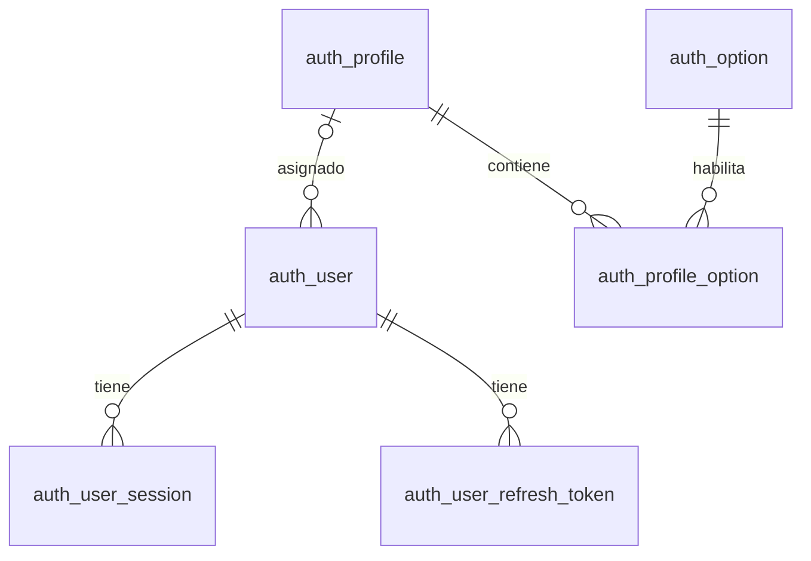

# Módulo de base de datos

[`src/modules/database`](../src/modules/database) implementa la persistencia en PostgreSQL mediante TypeORM. Contiene la configuración de conexión, las entidades, los repositorios y las migraciones para usuarios, perfiles, opciones de permisos, sesiones y tokens de renovación.

## Estructura e integración

```text
src/modules/database/
├── database.module.ts
├── entities/       # Seis entidades que representan las tablas
├── repositories/   # Repositorio base y cinco proveedores de persistencia
└── migrations/     # Creación del esquema y carga inicial
```

[`DatabaseModule`](../src/modules/database/database.module.ts) está decorado con `@Global()` y se importa en [`AppModule`](../src/app.module.ts). Una vez registrado, sus proveedores exportados están disponibles para los demás módulos sin que cada uno tenga que importarlo explícitamente.

El módulo configura `TypeOrmModule.forRoot`, registra las seis entidades mediante `TypeOrmModule.forFeature` y exporta:

- `UserTypeOrmRepository`.
- `ProfileTypeOrmRepository`.
- `OptionTypeOrmRepository`.
- `SessionTypeOrmRepository`.
- `RefreshTokenTypeOrmRepository`.

No tiene controladores ni un repositorio específico para `ProfileOptionEntity`. Su método `onModuleInit` registra `DatabaseModule initialized` en el logger de NestJS.

## Configuración

Los parámetros proceden de [`app.config.ts`](../src/app.config.ts), que carga variables de entorno mediante `dotenv`.

| Variable | Valor predeterminado | Uso |
| --- | --- | --- |
| `POSTGRES_HOST` | Cadena vacía | Servidor PostgreSQL. |
| `POSTGRES_PORT` | `0` | Puerto de conexión. |
| `POSTGRES_USERNAME` | Cadena vacía | Usuario. |
| `POSTGRES_PASSWORD` | Cadena vacía | Contraseña. |
| `POSTGRES_DATABASE` | Cadena vacía | Base de datos. |
| `POSTGRES_CONNECTIONNAME` | `default` | Nombre de la conexión registrada e inyectada. |
| `POSTGRES_SYNCRONIZE` | `false` | Sincronización del esquema a partir de entidades. Conserva la escritura utilizada en el código. |
| `POSTGRES_LOGGING` | `false` | Registro de operaciones de TypeORM. |
| `POSTGRES_MIGRATIONSRUN` | `false` | Ejecución de migraciones pendientes al inicializar la conexión. |
| `POSTGRES_MAXEXECUTIONTIME` | `30000` | Umbral en milisegundos para registrar consultas lentas; no cancela su ejecución. |

Los booleanos solo se activan con las cadenas exactas `true` o `1`. Los parámetros numéricos se convierten mediante `Number`, sin validación adicional en `AppConfig`.

Las rutas de descubrimiento son relativas a `__dirname`:

```typescript
migrations: [__dirname + '/migrations/*.migration{.ts,.js}']
entities: [__dirname + '/entities/*.entity{.ts,.js}']
```

También se establece `autoLoadEntities: true`. Tanto `forFeature` como `@InjectDataSource` utilizan `appConfig.postgres_connectionName`.

## Modelo de datos

El diagrama representa las claves foráneas creadas por las migraciones. Algunas no tienen una relación de objeto equivalente en las entidades.


```mermaid
erDiagram
    auth_profile o|--o{ auth_user : asignado
    auth_profile ||--o{ auth_profile_option : contiene
    auth_option ||--o{ auth_profile_option : habilita
    auth_user ||--o{ auth_user_session : tiene
    auth_user ||--o{ auth_user_refresh_token : tiene
```

Las siguientes tablas usan los tipos SQL definidos en las migraciones. Las columnas son obligatorias salvo donde se indica que admiten `NULL`.

### `OptionEntity` → `auth_option`

Fuente: [`option.entity.ts`](../src/modules/database/entities/option.entity.ts).

| Propiedad | Columna | Tipo SQL | Detalle |
| --- | --- | --- | --- |
| `optionId` | `option_id` | `int` | Clave primaria asignada explícitamente; la entidad declara `numeric`. |
| `code` | `code` | `varchar(50)` | Código del permiso. |
| `name` | `name` | `varchar(50)` | Nombre. |
| `description` | `description` | `varchar(100)` | Admite `NULL`. |
| `isActive` | `is_active` | `boolean` | Estado de la opción. |

### `ProfileEntity` → `auth_profile`

Fuente: [`profile.entity.ts`](../src/modules/database/entities/profile.entity.ts).

| Propiedad | Columna | Tipo SQL | Detalle |
| --- | --- | --- | --- |
| `profileId` | `profile_id` | `uuid` | Clave primaria generada. |
| `name` | `name` | `varchar(50)` | Nombre del perfil. |
| `description` | `description` | `varchar(100)` | Admite `NULL`. |
| `isInternal` | `is_internal` | `boolean` | Identifica un perfil interno. |
| `isActive` | `is_active` | `boolean` | Estado. |
| `createdAt` | `created_at` | `timestamp` | Fecha de creación. |
| `updatedAt` | `updated_at` | `timestamp` | Admite `NULL`. |

`profileOptions` es una relación `OneToMany` con `ProfileOptionEntity`.

### `ProfileOptionEntity` → `auth_profile_option`

Fuente: [`profileOption.entity.ts`](../src/modules/database/entities/profileOption.entity.ts).

| Propiedad | Columna | Tipo SQL | Detalle |
| --- | --- | --- | --- |
| `profileId` | `profile_id` | `uuid` | Clave foránea a `auth_profile.profile_id`. |
| `optionId` | `option_id` | `int` | Clave foránea a `auth_option.option_id`; la entidad declara `numeric`. |

La clave primaria es compuesta: `(profile_id, option_id)`. La propiedad `profile` declara una relación `ManyToOne` con `ProfileEntity`. No hay una relación de objeto con `OptionEntity`, aunque la migración crea esa clave foránea.

### `UserEntity` → `auth_user`

Fuente: [`user.entity.ts`](../src/modules/database/entities/user.entity.ts).

| Propiedad | Columna | Tipo SQL | Detalle |
| --- | --- | --- | --- |
| `userId` | `user_id` | `uuid` | Clave primaria generada. |
| `userName` | `user_name` | `varchar(64)` | Nombre de acceso. |
| `password` | `password` | `varchar(64)` | Hash; excluido de las lecturas ordinarias mediante `select: false`. |
| `firstName` | `first_name` | `varchar(50)` | Nombre. |
| `middleName` | `middle_name` | `varchar(50)` | Admite `NULL`. |
| `lastName` | `last_name` | `varchar(50)` | Apellido. |
| `email` | `email` | `varchar(320)` | Correo. |
| `phone` | `phone` | `varchar(15)` | Teléfono. |
| `isActive` | `is_active` | `boolean` | Estado. |
| `createdAt` | `created_at` | `timestamp` | Fecha de creación. |
| `updatedAt` | `updated_at` | `timestamp` | Admite `NULL`. |
| `profileId` | `profile_id` | `uuid` | Admite `NULL`; clave foránea a `auth_profile.profile_id`. |

La propiedad `profile` es una relación `ManyToOne` opcional. Aunque la columna admite `NULL`, los métodos de creación y actualización del repositorio comprueban la existencia de un perfil activo.

### Sesiones y tokens de renovación

Fuentes: [`session.entity.ts`](../src/modules/database/entities/session.entity.ts) y [`refreshToken.entity.ts`](../src/modules/database/entities/refreshToken.entity.ts).

| Entidad | Tabla | Propiedad / columna de clave primaria |
| --- | --- | --- |
| `SessionEntity` | `auth_user_session` | `sessionId` / `session_id` |
| `RefreshTokenEntity` | `auth_user_refresh_token` | `refreshTokenId` / `refresh_token_id` |

Ambas claves primarias son UUID generados. Las dos entidades tienen además:

| Propiedad | Columna | Tipo SQL | Detalle |
| --- | --- | --- | --- |
| `userId` | `user_id` | `uuid` | Referencia obligatoria a `auth_user.user_id`. |
| `jti` | `jti` | `varchar(36)` | Identificador del token, no el JWT completo. |
| `expiresAt` | `expires_at` | `timestamp` | Fecha de expiración. |

Las migraciones crean ambas referencias al usuario con `ON DELETE CASCADE`. Las entidades solo declaran `userId`, sin relación de objeto con `UserEntity`. No hay una clave foránea que vincule sesiones con tokens de renovación.

Las migraciones no crean restricciones únicas para `user_name`, `email`, `code` ni `jti`, ni índices secundarios explícitos. Las fechas y los estados no tienen valores predeterminados en el esquema. `createdAt` y `updatedAt` son columnas normales, no decoradores de fecha automática.

## Repositorios

Los cinco proveedores concretos son `@Injectable()` y heredan de [`TypeOrmRepository`](../src/modules/database/repositories/typeorm.repository.ts). Esta clase conserva el `DataSource` inyectado y lo expone mediante `getDataSource(): DataSource`. Cada proveedor obtiene su repositorio de entidad desde `dataSource.manager.getRepository(...)`.

Todos los métodos de persistencia reciben `logId: string` como último argumento. Las lecturas individuales convierten el resultado `null` de TypeORM en `undefined`.

### `UserTypeOrmRepository`

Fuente: [`user.typeorm.repository.ts`](../src/modules/database/repositories/user.typeorm.repository.ts).

| Método | Retorno asíncrono | Comportamiento |
| --- | --- | --- |
| `create(user, logId)` | `string` | Comprueba perfil activo, calcula el hash de `user.password`, guarda y devuelve `user.userId`. |
| `readActiveByUserId(userId, logId)` | `UserEntity \| undefined` | Busca por ID con `isActive: true`. |
| `readByUserId(userId, logId)` | `UserEntity \| undefined` | Busca por ID sin filtrar estado. |
| `readByUsernameAndPassword(userName, password, logId)` | `UserEntity \| undefined` | Calcula el hash de la contraseña y busca por nombre y hash; no filtra estado. |
| `update(user, changePassword, logId)` | `void` | Comprueba usuario y perfil activo, asigna `updatedAt` y actualiza. |
| `delete(userId, logId)` | `void` | Comprueba existencia y elimina físicamente el usuario. |
| `search(logId)` | `UserEntity[]` | Devuelve todos los usuarios sin cargar relaciones explícitamente. |

Las tres lecturas individuales cargan `profile.profileOptions`. No filtran el estado del perfil ni el de sus opciones. `search` no incorpora paginación, filtros ni orden explícito.

En `update`, si `changePassword` es `true`, se transforma la contraseña y se utiliza `save(user)`. Si es `false`, se actualizan exclusivamente `firstName`, `middleName`, `lastName`, `email`, `phone`, `isActive`, `updatedAt` y `profileId`; esa rama no modifica `userName` ni `password`.

[`Utils.createHash`](../src/modules/shared/utils/utils.ts) aplica SHA-256 sin sal y devuelve 64 caracteres hexadecimales. `create` y la actualización con cambio de contraseña modifican la propiedad `password` del objeto recibido. El repositorio no asigna `createdAt` al crear; el llamador debe proporcionarlo.

La exclusión `select: false` evita devolver la contraseña en las lecturas ordinarias, pero permite usarla como condición de búsqueda. `delete` no desactiva al usuario: lo elimina y, con las claves foráneas de las migraciones, también se eliminan sus sesiones y tokens de renovación.

### Perfiles y opciones

| Repositorio | Método | Retorno asíncrono | Comportamiento |
| --- | --- | --- | --- |
| [`ProfileTypeOrmRepository`](../src/modules/database/repositories/profile.typeorm.repository.ts) | `exists(profileId, isActive, logId)` | `boolean` | Comprueba conjuntamente el ID y el estado solicitado. |
| [`OptionTypeOrmRepository`](../src/modules/database/repositories/option.typeorm.repository.ts) | `search(logId)` | `OptionEntity[]` | Lista todas las opciones, incluidas las inactivas. |

Estos repositorios no ofrecen operaciones de escritura. La interpretación de las opciones como permisos corresponde a sus consumidores.

### `SessionTypeOrmRepository`

Fuente: [`session.typeorm.repository.ts`](../src/modules/database/repositories/session.typeorm.repository.ts).

| Método | Retorno asíncrono | Comportamiento |
| --- | --- | --- |
| `create(sessionEntity, manager, logId)` | `string` | Guarda y devuelve `sessionId`. |
| `readBySessionId(sessionId, logId)` | `SessionEntity \| undefined` | Busca por clave primaria. |
| `readByJTI(jti, logId)` | `SessionEntity \| undefined` | Busca una sesión por JTI. |
| `delete(sessionId, logId)` | `DeleteResult` | Elimina por clave primaria. |
| `deleteByJTI(jti, manager, logId)` | `DeleteResult` | Elimina todos los registros que coincidan con el JTI. |

### `RefreshTokenTypeOrmRepository`

Fuente: [`refreshToken.typeorm.repository.ts`](../src/modules/database/repositories/refreshToken.typeorm.repository.ts).

| Método | Retorno asíncrono | Comportamiento |
| --- | --- | --- |
| `readByJTI(jti, logId)` | `RefreshTokenEntity \| undefined` | Busca un registro por JTI. |
| `create(refreshToken, manager, logId)` | `string` | Guarda y devuelve `refreshTokenId`. |
| `deleteByJTI(jti, manager, logId)` | `DeleteResult` | Elimina todos los registros que coincidan con el JTI. |

Los repositorios de sesiones y tokens no verifican `expiresAt` al leer ni incluyen limpieza automática de registros vencidos. Sus métodos de borrado no comprueban previamente la existencia; el llamador puede consultar `DeleteResult.affected`.

## Transacciones y errores

Los métodos `create` y `deleteByJTI` de sesiones y tokens reciben `manager: EntityManager | undefined`. Se debe pasar ese argumento, aunque sea `undefined`:

- Con un administrador, usan `manager.getRepository(...)` para participar en su transacción.
- Con `undefined`, usan el repositorio habitual del proveedor.

Ejemplo dentro de un servicio con ambos repositorios inyectados:

```typescript
await this.sessionRepository.getDataSource().transaction(async (manager) => {
  await this.sessionRepository.deleteByJTI(jti, manager, logId);
  await this.refreshTokenRepository.deleteByJTI(jti, manager, logId);
});
```

El llamador debe esperar o devolver la promesa de `transaction` para conocer su finalización y recibir errores. Los demás métodos no aceptan un administrador transaccional externo.

Los errores se envuelven en [`RepositoryError`](../src/modules/shared/errors/repository.error.ts), que conserva el original en `innerError` y registra el mensaje con el identificador de seguimiento. Las validaciones de usuario y perfil utilizan `User not found.` y `Profile not found.`; los métodos de escritura de usuarios propagan los `RepositoryError` ya construidos.

Existen detalles de trazabilidad en la implementación actual: `SessionTypeOrmRepository.create` omite `logId` al construir su error, `OptionTypeOrmRepository.search` registra `ProfileRepository.search` y algunos mensajes de eliminación de tokens mencionan sesiones.

## Migraciones

Los archivos de [`migrations`](../src/modules/database/migrations) implementan `MigrationInterface`, con `up` para aplicar y `down` para revertir. Se ordenan por el timestamp de sus clases:

| Timestamp | Archivo | Acción de `up` |
| --- | --- | --- |
| `1763596800000` | `createOptionTable.migration.ts` | Crea `auth_option`. |
| `1763596800001` | `createProfileTable.migration.ts` | Crea `auth_profile`. |
| `1763596800002` | `createProfileOptionTable.migration.ts` | Crea la tabla intermedia, su clave compuesta y dos claves foráneas. |
| `1763596800003` | `createUserTable.migration.ts` | Crea `auth_user` y su referencia opcional al perfil. |
| `1763596800004` | `createRefreshTokenTable.migration.ts` | Crea `auth_user_refresh_token`, con borrado en cascada desde el usuario. |
| `1763596800005` | `createSessionTable.migration.ts` | Crea `auth_user_session`, con borrado en cascada desde el usuario. |
| `1763596800006` | `insertDataTable.migration.ts` | Inserta opciones, perfil administrador, asignaciones y usuario inicial. |

### Datos iniciales

La última migración inserta las siguientes opciones activas:

| ID | Código | ID | Código |
| --- | --- | --- | --- |
| 1 | `USER_CREATE` | 6 | `PROFILE_CREATE` |
| 2 | `USER_READ` | 7 | `PROFILE_READ` |
| 3 | `USER_UPDATE` | 8 | `PROFILE_UPDATE` |
| 4 | `USER_DELETE` | 9 | `PROFILE_DELETE` |
| 5 | `USER_SEARCH` | 10 | `PROFILE_SEARCH` |

Crea el perfil `admin`, interno y activo, y le asigna las diez opciones. También crea un usuario activo con `userName: admin`, correo `admin@base.com`, teléfono `55555555` y contraseña inicial `password123`, almacenada mediante `Utils.createHash`. Su perfil es el recién insertado. Estos valores están fijados en la migración y no se obtienen del entorno.

### Ejecución al arrancar

Con PostgreSQL disponible y las variables de conexión configuradas, las migraciones pendientes pueden ejecutarse al iniciar la aplicación estableciendo:

```dotenv
POSTGRES_SYNCRONIZE=false
POSTGRES_MIGRATIONSRUN=true
```

El script de desarrollo disponible es:

```sh
npm run start:dev
```

Para código compilado, los scripts son `npm run build` y `npm run start:prod`. El proyecto no incluye scripts específicos de CLI para generar, ejecutar o revertir migraciones, ni un archivo independiente de `DataSource` para ese fin.

### Reversión

Los métodos `down` de las seis migraciones de estructura eliminan la tabla creada por su respectivo `up`. En particular, la migración de sesiones elimina `auth_user_session`.

El `down` de `1763596800006-insertDataTable.migration.ts` elimina los datos en este orden:

1. `auth_profile_option`: asignaciones de permisos a perfiles.
2. `auth_option`: opciones de permisos.
3. `auth_user`: usuarios; sus sesiones y tokens se eliminan en cascada.
4. `auth_profile`: perfiles.

Este orden elimina primero los registros dependientes y respeta las claves foráneas definidas en las migraciones. La operación utiliza `deleteAll`, sin filtrar por los identificadores o nombres de la carga inicial.

### Diferencias y limitaciones actuales

- `option_id` es `int` en las migraciones y `numeric` en las entidades `OptionEntity` y `ProfileOptionEntity`.
- Las claves foráneas de sesiones y tokens hacia usuarios, y de asignaciones hacia opciones, existen en las migraciones pero no como relaciones de entidad. La sincronización y las migraciones no describen exactamente el mismo esquema.
- El `down` de la carga inicial usa `deleteAll`: elimina todos los registros de las tablas implicadas, no solo los insertados por `up`. El borrado de usuarios también elimina sus sesiones y tokens por las claves foráneas con `ON DELETE CASCADE`.

Estas diferencias describen el código actual y deben considerarse al sincronizar el esquema o revertir migraciones.
