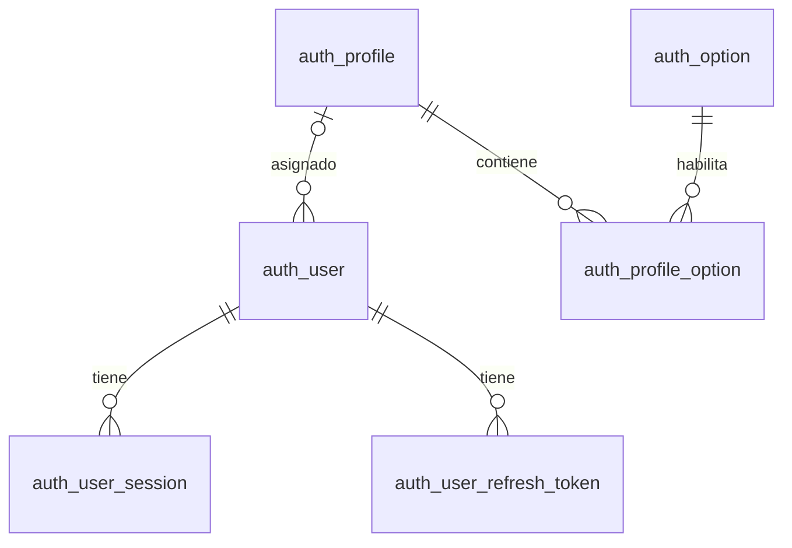

# Módulo de base de datos

El código se encuentra en [`src/modules/database`](../src/modules/database), no en `src/database`. Implementa la persistencia en PostgreSQL mediante TypeORM y NestJS para usuarios, perfiles, permisos, sesiones y tokens de actualización.

## Estructura e integración

```text
src/modules/database/
├── database.module.ts
├── entities/       # Mapeo de clases a tablas
├── migrations/     # Creación del esquema y carga inicial
└── repositories/   # Operaciones de persistencia
```

[`DatabaseModule`](../src/modules/database/database.module.ts) configura la conexión con `TypeOrmModule.forRoot`, registra las seis entidades con `TypeOrmModule.forFeature` y expone cinco proveedores: `UserTypeOrmRepository`, `ProfileTypeOrmRepository`, `OptionTypeOrmRepository`, `SessionTypeOrmRepository` y `RefreshTokenTypeOrmRepository`. No expone controladores ni un repositorio específico para `ProfileOptionEntity`.

El módulo se importa desde [`AppModule`](../src/app.module.ts). Los módulos que necesiten sus proveedores deben importar `DatabaseModule`; no está declarado como global. Al inicializarse registra `DatabaseModule initialized` en el logger de NestJS.

## Configuración

La conexión usa el singleton de [`app.config.ts`](../src/app.config.ts), que carga variables de entorno mediante `dotenv`.

| Variable | Valor predeterminado | Uso |
| --- | --- | --- |
| `POSTGRES_HOST` | Cadena vacía | Servidor PostgreSQL. |
| `POSTGRES_PORT` | `0` | Puerto, convertido mediante `Number`. |
| `POSTGRES_USERNAME` | Cadena vacía | Usuario de conexión. |
| `POSTGRES_PASSWORD` | Cadena vacía | Contraseña de conexión. |
| `POSTGRES_DATABASE` | Cadena vacía | Nombre de la base de datos. |
| `POSTGRES_CONNECTIONNAME` | `default` | Nombre usado tanto al registrar como al inyectar la conexión. |
| `POSTGRES_SYNCRONIZE` | `false` | Corresponde a `synchronize`; conserva la escritura utilizada en el código. |
| `POSTGRES_LOGGING` | `false` | Activa el registro de TypeORM. |
| `POSTGRES_MIGRATIONSRUN` | `false` | Ejecuta las migraciones pendientes al inicializar la conexión. |
| `POSTGRES_MAXEXECUTIONTIME` | `30000` | Umbral en milisegundos para registrar consultas lentas; no es un tiempo límite de cancelación. |

Los booleanos solo se activan con las cadenas exactas `true` o `1`. Los valores numéricos no tienen validación adicional en `AppConfig`.

El módulo descubre entidades con `entities/*.entity{.ts,.js}` y migraciones con `migrations/*.migration{.ts,.js}`, relativas a `__dirname`. También establece `autoLoadEntities: true`.

## Modelo de datos

El siguiente diagrama representa las claves foráneas creadas por las migraciones. No todas tienen una relación declarada en los decoradores de las entidades.


```mermaid
erDiagram
    auth_profile o|--o{ auth_user : asignado
    auth_profile ||--o{ auth_profile_option : contiene
    auth_option ||--o{ auth_profile_option : habilita
    auth_user ||--o{ auth_user_session : tiene
    auth_user ||--o{ auth_user_refresh_token : tiene
```

Las tablas siguientes describen los tipos SQL de las migraciones y su correspondencia con las propiedades TypeScript. Salvo indicación contraria, las columnas no aceptan `NULL`.

### Opciones: `OptionEntity` → `auth_option`

Fuente: [`option.entity.ts`](../src/modules/database/entities/option.entity.ts).

| Propiedad | Columna | Tipo SQL | Detalle |
| --- | --- | --- | --- |
| `optionId` | `option_id` | `int` | Clave primaria, asignada explícitamente. La entidad declara `numeric`. |
| `code` | `code` | `varchar(50)` | Código del permiso. |
| `name` | `name` | `varchar(50)` | Nombre. |
| `description` | `description` | `varchar(100)` | Admite `NULL`. |
| `isActive` | `is_active` | `boolean` | Estado. |

### Perfiles: `ProfileEntity` → `auth_profile`

Fuente: [`profile.entity.ts`](../src/modules/database/entities/profile.entity.ts).

| Propiedad | Columna | Tipo SQL | Detalle |
| --- | --- | --- | --- |
| `profileId` | `profile_id` | `uuid` | Clave primaria generada. |
| `name` | `name` | `varchar(50)` | Nombre del perfil. |
| `description` | `description` | `varchar(100)` | Admite `NULL`. |
| `isInternal` | `is_internal` | `boolean` | Identifica un perfil interno. |
| `isActive` | `is_active` | `boolean` | Estado. |
| `createdAt` | `created_at` | `timestamp` | Fecha de creación. |
| `updatedAt` | `updated_at` | `timestamp` | Admite `NULL`. |

`profileOptions` es una relación `OneToMany` con `ProfileOptionEntity`.

### Asignación de permisos: `ProfileOptionEntity` → `auth_profile_option`

Fuente: [`profileOption.entity.ts`](../src/modules/database/entities/profileOption.entity.ts).

| Propiedad | Columna | Tipo SQL | Detalle |
| --- | --- | --- | --- |
| `profileId` | `profile_id` | `uuid` | Clave foránea a `auth_profile`. |
| `optionId` | `option_id` | `int` | Clave foránea a `auth_option`; la entidad declara `numeric`. |

La clave primaria es compuesta: `(profile_id, option_id)`. La entidad declara la relación `ManyToOne` llamada `profile`; no declara una relación de objeto con `OptionEntity`, aunque la migración sí crea su clave foránea.

### Usuarios: `UserEntity` → `auth_user`

Fuente: [`user.entity.ts`](../src/modules/database/entities/user.entity.ts).

| Propiedad | Columna | Tipo SQL | Detalle |
| --- | --- | --- | --- |
| `userId` | `user_id` | `uuid` | Clave primaria generada. |
| `userName` | `user_name` | `varchar(64)` | Nombre de acceso. |
| `password` | `password` | `varchar(64)` | Hash; excluido de las lecturas ordinarias mediante `select: false`. |
| `firstName` | `first_name` | `varchar(50)` | Nombre. |
| `middleName` | `middle_name` | `varchar(50)` | Admite `NULL`. |
| `lastName` | `last_name` | `varchar(50)` | Apellido. |
| `email` | `email` | `varchar(320)` | Correo electrónico. |
| `phone` | `phone` | `varchar(15)` | Teléfono. |
| `isActive` | `is_active` | `boolean` | Estado. |
| `createdAt` | `created_at` | `timestamp` | Fecha de creación. |
| `updatedAt` | `updated_at` | `timestamp` | Admite `NULL`. |
| `profileId` | `profile_id` | `uuid` | Admite `NULL`; clave foránea a `auth_profile`. |

`profile` es una relación `ManyToOne` opcional. Aunque el esquema admite usuarios sin perfil, los métodos `create` y `update` del repositorio comprueban la existencia de un perfil activo.

### Sesiones y tokens de actualización

Fuentes: [`session.entity.ts`](../src/modules/database/entities/session.entity.ts) y [`refreshToken.entity.ts`](../src/modules/database/entities/refreshToken.entity.ts).

| Entidad / tabla | Propiedad de clave primaria | Columna de clave primaria |
| --- | --- | --- |
| `SessionEntity` / `auth_user_session` | `sessionId` | `session_id` |
| `RefreshTokenEntity` / `auth_user_refresh_token` | `refreshTokenId` | `refresh_token_id` |

Ambas claves primarias son UUID generados. Las dos tablas contienen además:

| Propiedad | Columna | Tipo SQL | Detalle |
| --- | --- | --- | --- |
| `userId` | `user_id` | `uuid` | Clave foránea obligatoria a `auth_user`. |
| `jti` | `jti` | `varchar(36)` | Identificador del token. |
| `expiresAt` | `expires_at` | `timestamp` | Fecha de expiración. |

Las migraciones establecen `ON DELETE CASCADE` desde el usuario hacia ambas tablas. Las entidades solo declaran `userId`, sin una relación de objeto a `UserEntity`. Se almacena el JTI, no el JWT completo. No hay clave foránea entre una sesión y un token de actualización.

Las migraciones no agregan restricciones únicas a `user_name`, `email`, `code` ni `jti`, ni índices secundarios explícitos. Las fechas y los estados no tienen valores predeterminados en estas definiciones; `createdAt` y `updatedAt` son columnas normales, no decoradores de fecha automática.

## Repositorios

Todos los repositorios concretos son inyectables y heredan de [`TypeOrmRepository`](../src/modules/database/repositories/typeorm.repository.ts). Esta clase conserva el `DataSource` de la conexión configurada y lo expone mediante `getDataSource(): DataSource`.

Cada repositorio obtiene su `Repository<T>` desde `dataSource.manager`. Los métodos reciben `logId: string` para correlacionar mensajes. Las lecturas individuales convierten el resultado `null` de TypeORM en `undefined`.

### `UserTypeOrmRepository`

Fuente: [`user.typeorm.repository.ts`](../src/modules/database/repositories/user.typeorm.repository.ts).

| Método | Retorno asíncrono | Comportamiento |
| --- | --- | --- |
| `create(user, logId)` | `string` | Valida el perfil activo, transforma `user.password` con `Utils.createHash`, guarda y devuelve `user.userId`. |
| `readActiveByUserId(userId, logId)` | `UserEntity \| undefined` | Busca un usuario activo y carga `profile.profileOptions`. |
| `readByUserId(userId, logId)` | `UserEntity \| undefined` | Busca por ID sin filtrar estado y carga `profile.profileOptions`. |
| `readByUsernameAndPassword(userName, password, logId)` | `UserEntity \| undefined` | Calcula el hash de la contraseña y busca por ambos campos, con `profile.profileOptions`. No filtra `isActive`. |
| `update(user, changePassword, logId)` | `void` | Comprueba usuario y perfil activo, y asigna `updatedAt = new Date()`. |
| `delete(userId, logId)` | `void` | Comprueba existencia y elimina físicamente el usuario. |
| `search(logId)` | `UserEntity[]` | Devuelve todos los usuarios sin cargar relaciones explícitamente. |

En `update`, si `changePassword` es `true`, se calcula el hash y se guarda la entidad con `save`. Si es `false`, se actualizan exclusivamente `firstName`, `middleName`, `lastName`, `email`, `phone`, `isActive`, `updatedAt` y `profileId`; esa rama no modifica `userName` ni `password`.

[`Utils.createHash`](../src/modules/shared/utils/utils.ts) utiliza SHA-256 sin sal y devuelve una cadena hexadecimal de 64 caracteres. La contraseña puede utilizarse como condición de búsqueda aunque `select: false` impida devolverla en las lecturas ordinarias.

`search` no implementa filtros, paginación ni orden explícito. Los errores de validación de `create`, `update` y `delete` usan `RepositoryError` con mensajes `Profile not found.` o `User not found.`, según corresponda.

### `ProfileTypeOrmRepository` y `OptionTypeOrmRepository`

| Repositorio | Método | Retorno asíncrono | Comportamiento |
| --- | --- | --- | --- |
| [`ProfileTypeOrmRepository`](../src/modules/database/repositories/profile.typeorm.repository.ts) | `exists(profileId, isActive, logId)` | `boolean` | Comprueba conjuntamente el ID y el estado solicitado. |
| [`OptionTypeOrmRepository`](../src/modules/database/repositories/option.typeorm.repository.ts) | `search(logId)` | `OptionEntity[]` | Devuelve todas las opciones, incluidas las inactivas. |

Estos repositorios no ofrecen operaciones de escritura. La conversión de opciones a códigos de permisos se realiza fuera del módulo, en [`AuthRepository`](../src/modules/auth/infrastructure/repositories/auth.repository.ts), que cruza las asignaciones del perfil con las opciones activas.

### `SessionTypeOrmRepository`

Fuente: [`session.typeorm.repository.ts`](../src/modules/database/repositories/session.typeorm.repository.ts).

| Método | Retorno asíncrono | Comportamiento |
| --- | --- | --- |
| `create(sessionEntity, manager, logId)` | `string` | Guarda y devuelve `sessionId`. |
| `readBySessionId(sessionId, logId)` | `SessionEntity \| undefined` | Busca por clave primaria. |
| `readByJTI(jti, logId)` | `SessionEntity \| undefined` | Busca una sesión por JTI. |
| `delete(sessionId, logId)` | `DeleteResult` | Elimina por clave primaria. |
| `deleteByJTI(jti, manager, logId)` | `DeleteResult` | Elimina los registros que coincidan con el JTI. |

### `RefreshTokenTypeOrmRepository`

Fuente: [`refreshToken.typeorm.repository.ts`](../src/modules/database/repositories/refreshToken.typeorm.repository.ts).

| Método | Retorno asíncrono | Comportamiento |
| --- | --- | --- |
| `readByJTI(jti, logId)` | `RefreshTokenEntity \| undefined` | Busca un token de actualización por JTI. |
| `create(refreshToken, manager, logId)` | `string` | Guarda y devuelve `refreshTokenId`. |
| `deleteByJTI(jti, manager, logId)` | `DeleteResult` | Elimina los registros que coincidan con el JTI. |

Las lecturas de sesiones y tokens no comparan `expiresAt` con la fecha actual. Este módulo tampoco incluye una tarea de limpieza de registros expirados. Los métodos de eliminación de estos dos repositorios no comprueban previamente la existencia; el llamador puede inspeccionar `DeleteResult.affected`.

## Transacciones y errores

Los métodos `create` y `deleteByJTI` de sesiones y tokens aceptan `manager: EntityManager | undefined`. El argumento debe proporcionarse, aunque sea `undefined`: cuando contiene un administrador transaccional, el método usa `manager.getRepository(...)`; en otro caso utiliza su repositorio habitual.

Ejemplo dentro de un servicio que tiene inyectados ambos repositorios:

```typescript
await this.sessionRepository.getDataSource().transaction(async (manager) => {
  await this.sessionRepository.deleteByJTI(jti, manager, logId);
  await this.refreshTokenRepository.deleteByJTI(jti, manager, logId);
});
```

El llamador debe esperar o devolver la promesa de `transaction` para conocer su finalización y recibir sus errores. El resto de los métodos no recibe un administrador transaccional externo.

Las operaciones capturan errores de persistencia y los envuelven en [`RepositoryError`](../src/modules/shared/errors/repository.error.ts), que conserva el error original en `innerError` y registra el mensaje. `SessionTypeOrmRepository.create` omite `logId` al construir ese error, aunque sí lo usa en sus mensajes iniciales. Algunos mensajes conservan nombres de otras operaciones: por ejemplo, `OptionTypeOrmRepository.search` registra `ProfileRepository.search`.

## Migraciones y datos iniciales

Las migraciones se encuentran en [`migrations`](../src/modules/database/migrations) y definen los siguientes pasos en orden de timestamp:

| Timestamp | Archivo | Acción de `up` |
| --- | --- | --- |
| `1763596800000` | `createOptionTable.migration.ts` | Crea `auth_option`. |
| `1763596800001` | `createProfileTable.migration.ts` | Crea `auth_profile`. |
| `1763596800002` | `createProfileOptionTable.migration.ts` | Crea la tabla intermedia, su clave compuesta y sus dos claves foráneas. |
| `1763596800003` | `createUserTable.migration.ts` | Crea `auth_user` y su referencia opcional al perfil. |
| `1763596800004` | `createRefreshTokenTable.migration.ts` | Crea `auth_user_refresh_token` con borrado en cascada desde el usuario. |
| `1763596800005` | `createSessionTable.migration.ts` | Crea `auth_user_session` con borrado en cascada desde el usuario. |
| `1763596800006` | `insertDataTable.migration.ts` | Inserta permisos, perfil administrador, asignaciones y usuario inicial. |

La carga inicial crea diez opciones activas:

| ID | Código | ID | Código |
| --- | --- | --- | --- |
| 1 | `USER_CREATE` | 6 | `PROFILE_CREATE` |
| 2 | `USER_READ` | 7 | `PROFILE_READ` |
| 3 | `USER_UPDATE` | 8 | `PROFILE_UPDATE` |
| 4 | `USER_DELETE` | 9 | `PROFILE_DELETE` |
| 5 | `USER_SEARCH` | 10 | `PROFILE_SEARCH` |

También crea el perfil `admin`, interno y activo, con las diez opciones, y el usuario activo `admin`, con correo `admin@base.com` y contraseña inicial `password123` almacenada mediante `Utils.createHash`. Estos valores están fijados en la migración, no proceden de variables de entorno.

### Ejecución

Para aplicar las migraciones pendientes al arrancar, configurar los datos de conexión y establecer:

```dotenv
POSTGRES_SYNCRONIZE=false
POSTGRES_MIGRATIONSRUN=true
```

Después, iniciar la aplicación con el script existente:

```sh
npm run start:dev
```

Para ejecutar el código compilado, los scripts disponibles son `npm run build` y `npm run start:prod`. El proyecto no incluye scripts específicos para generar, ejecutar o revertir migraciones mediante la CLI, ni un archivo independiente de configuración `DataSource` para ella.

### Diferencias y limitaciones del código actual

- Las migraciones definen `option_id` como `int`, mientras que `OptionEntity` y `ProfileOptionEntity` lo declaran como `numeric`.
- Las claves foráneas desde sesiones y tokens hacia usuarios, y desde la tabla intermedia hacia opciones, están en las migraciones pero no en relaciones de entidad. Por estas diferencias, la sincronización de entidades y las migraciones no describen exactamente el mismo esquema.
- El `down` de `1763596800005-createSessionTable.migration.ts` intenta eliminar `auth_session`, aunque `up` crea `auth_user_session`.
- El `down` de la carga inicial usa `deleteAll` y no limita el borrado a los registros insertados por `up`. Además, elimina opciones antes que sus asignaciones y perfiles antes que usuarios, por lo que puede fallar por las claves foráneas existentes.

Estas observaciones describen la implementación actual; deben tenerse en cuenta antes de usar la sincronización o revertir migraciones.
